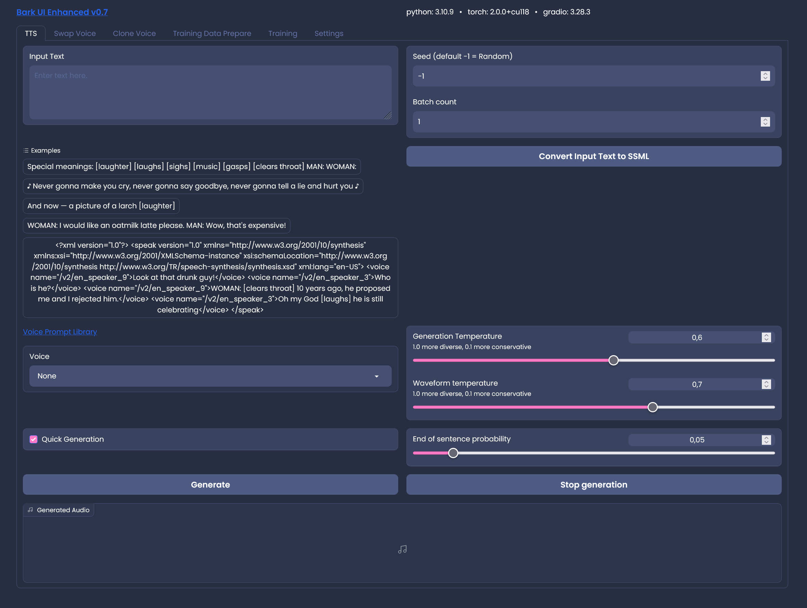

# Bark GUI

[Changelog](#changelog) • [Example](#example-input) • [Installation](#installation) • [Usage](#usage) • [FAQ](#faq)

A Gradio Web UI for an extended - easy to use - Bark Version, focused on Windows but not limited to.
Based on [Bark](https://github.com/suno-ai/bark)

</img>

### Additional Features

- Web GUI & Server
- Creation of very large text passages in chunks, combining the parts into a final result
- Voice cloning (input your voice audio & get a speaker back)
- Swap Voice in audio to the one you selected
- Easy Selection of Small/Big Models, additional commandline arguments
- Works with 6Gb NVIDIA/Apple GPU or force it to use your CPU instead
- Can input SSML to allow fixed voice dialogues (preliminary so far)
- Generation Metadata added as ID3 Tag to WAV
- Specify initial Seed and logging for more stability and easier reproduction of results
- Batch Generation to experiment with different seeds
- Gradio Theme Support 

### Example Input:

> Hello, I am called BARK and am a new text to audio model made by SUNO! Let me read an excerpt from War of the Worlds to you. [clears throat]
We know NOW that in the early years of the twentieth century, this world was being watched closely by intelligences greater than man's and yet as mortal as his own. We know NOW that as human beings busied themselves about their various concerns they were scrutinized and studied, perhaps almost as NARROWLY as a man with a Microscope might scrutinize the transient creatures that swarm and multiply in a drop of water. YET across an immense ethereal gulf, minds that to our minds as ours are to the beasts in the jungle, intellects vast, cool and unsympathetic, regarded this earth with envious eyes and slowly and surely drew their plans against us. [sighs] In the thirty-ninth year of the twentieth century came the great disillusionment.

[Play resulting audio](https://user-images.githubusercontent.com/131583554/234322414-c90330e4-bbe8-4047-bea6-1f783d49204f.webm)

### Installation

For Windows you can now use the 1-click installer released. This will download and install everything
in a handy conda environment. This not only installs the application but also runs it, once installed.

### **If you already have a windows install from a version prior to v0.7 then it might be a good idea to re-install with the latest installer, because it changed a lot and the old installer isn't compatible. To avoid re-downloading the models you could create a backup of the bark-gui\models folder first **
 
For other OS or if you'd rather like to do this by yourself then:

- `git clone https://github.com/C0untFloyd/bark-gui`
- `pip install .`
- (optional but best choice with NVIDIA GPUs) install Torch with CUDA `pip install torch torchvision torchaudio --index-url https://download.pytorch.org/whl/cu118 --force-reinstall`
- `pip install -r requirements.txt`

### Usage

- Windows Either run the `windows_run.bat` from the Installer or use the `StartBark.bat`. Edit the .bat files to add your desired commandline arguments 
- Linux `python webui.py (and optional commandline arguments)`

For more detailed instructions please have a look into the [Wiki](https://github.com/C0untFloyd/bark-gui/wiki)

### FAQ
**Q:** Why do I get the warning "No GPU being used. Careful, inference might be very slow!", although I do have a NVIDIA GPU?

You probably have outdated Torch/CUDA Drivers. Try re-installing them:
`pip install torch torchvision torchaudio --index-url https://download.pytorch.org/whl/cu117 --force-reinstall`

**Q:** I'm using Apple Silicone what can I do to speed up processing?

Use commandline argument `-enablemps` to make Bark use it.

**Q:** How much VRAM do I need to have this run on GPU?

Running this on GPU is currently only possible on NVIDIA Cards with at least 2 Gb VRAM. Below 8 Gb you
would probably need to use the smaller models and if you are still having memory problems, you would need
to use the -offloadcpu command argument, which tries to offload as much memory to your standard memory.

**Q:** Why are there voice changes in the resulting audio files?

Because (from my limited understanding) this is a similar stochastic model as other GPT-Style Models, where each output is based on a previous one.
This has a pretty good entertainment value but is of course suboptimal for plain TTS. Over time there surely will be a solution for stable generation.
Also from my experience, using the special tags like [sighs] etc. at the start/stop of a sentence seem to confuse the model. This seems to
be especially true for languages other than english. If you're not satisfied with the result, just try again and hope for the best.

**Q:** Why are cloned voices so bad?

This changed a short time ago for the better. Cloned voices aren't that bad anymore and with a bit of luck and a good audio input you can reproduce very stable speakers.
The reason why this is so hard is that the original Bark authors don't condone voice cloning and didn't give away the crucial model they are using for
creating speakers. So the community has to find ways to get around this and so far the best working method involves using the base Hubert model and training a custom quantifier.
This was found out by [Mylo](https://github.com/gitmylo/bark-voice-cloning-HuBERT-quantizer) so huge thanks to him! 

**Q:** Why did you hack this together, when will you implement feature xxx?

Although I'm an experienced programmer, this is my first step into python programming and ML and serves me basically as a learning project.
I've been excited by the Bark Release and as a windows-centric user wanted something simple to run locally, without
caring about colabs, notebooks and the likes. Basically a simple GUI to have fun with Bark. Many repos I checked
had something cool, but where missing features and had no user interface. So I took what I could get from them and improved upon it.
I'm doing this basically for myself but I'm glad if you enjoy my experiments too.

### Changelog

**23.07.2023** Release V0.7.4

- QoL pulled updates from Suno Main 

**04.07.2023** Release V0.7.3

- Spanish tokenizer by [MaxLancer](https://huggingface.co/Lancer1408/bark-es-tokenizer) added

**30.06.2023** Release V0.7.2

- Bugfix: Prepare Training missing number of generations
- Bugfix: Use GPU always true in training
- Bugfix: Enable MPS not working

**09.06.2023** Release V0.7 (huge breaking changes!)

- Implemented new voice cloning method, made possible by [Mylo](https://github.com/gitmylo/bark-voice-cloning-HuBERT-quantizer)
- Added Swap Voice Tab, to swap voices with selected speakers in input audio file, also made possible by the use of Hubert
- Added Training Preparation & Training Tabs to train quantifiers for your own native language (WIP)
- Trained my own german quantifier/tokenizer which will be downloaded/used when you're selecting german as base language for cloning
- Moved extra dependencies into separate requirements.txt allowing a simpler, cleaner install
- Rewrote parts of the 1-click installer due to that reason
- Refactored lots of stuff 

**16.05.2023** Release v0.4.8

- Batch count added for multiple generations of same input text - useful for comparing seeds or random voices
- Commented out rounding assert which seemed to break voice cloning with very long audio clips
- QoL Merges from Suno Main

**10.05.2023** Release v0.4.7

- BUGFIX: 1-click installer, several changes 
- BUGFIX: New commandline args weren't used
- Commandline-Args possible in windows installer

**09.05.2023** Release v0.4.6

- Restart Server in Settings
- Interrupt & Cancel Generation
- Delete Output Files moved to Settings

**08.05.2023** Release v0.4.5

- BUGFIX: Blank Voice Lines when splitting for SSML
- Added Settings Tab
- Added Theming Support
- Added initial Generation Seeds for reproducing results
- ID3 Tag with generation infos written to WAV
- Streamlined prompt settings, removed checkboxes for history prompts and added slider for min_eos_p
  

**03.05.2023** First Release v0.4.0

- BUGFIX: Joining prompt names in subfolders
- Release with Windows Installer (lifted & modified from [Oobabooga](https://github.com/oobabooga/one-click-installers))
- Installer .bat includes automatic updater
- Trying to detect voice changes, adding short pause breaks inbetween

**02.05.2023**

- Merged all changes from base Suno branch
- Preloading/downloading all necessary models before server startup
- Supporting subfolders in assets/prompts and new prompts in dropdown
- Added preliminary support/conversion for [SSML](https://www.xml.com/pub/a/2004/10/20/ssml.html) input to allow fixed speakers dialogues
- Added Button to delete all files in output folder
- Misc smaller changes/bugfixes
- Updated Readme.md

**24.04.2023**

Initial Fork & Commit

